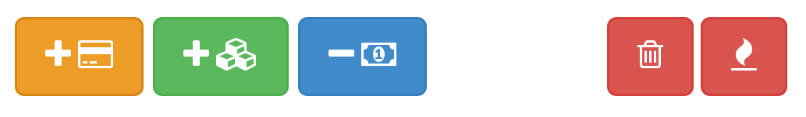

CashSplitter
============
Offline mobile webapp built on top of angular, pouchdb, bootstrap and grunt

- Add a trip

- Add people names participating to the trip (comma splitted)

- yellow button: add an equally divided bill, select names that participate to the bill (In italian: alla romana)

- green button: add an unequal bill, input different amount for everyone

- blue button: add a repayment from one to another

- trash icon: delete the trip

- flame icon: delete all bill and payments from the trip
